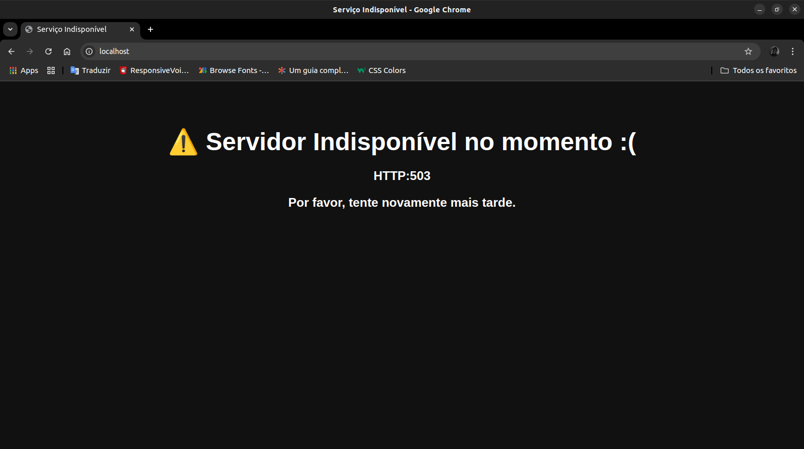
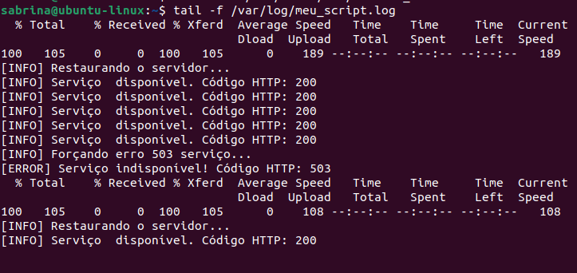
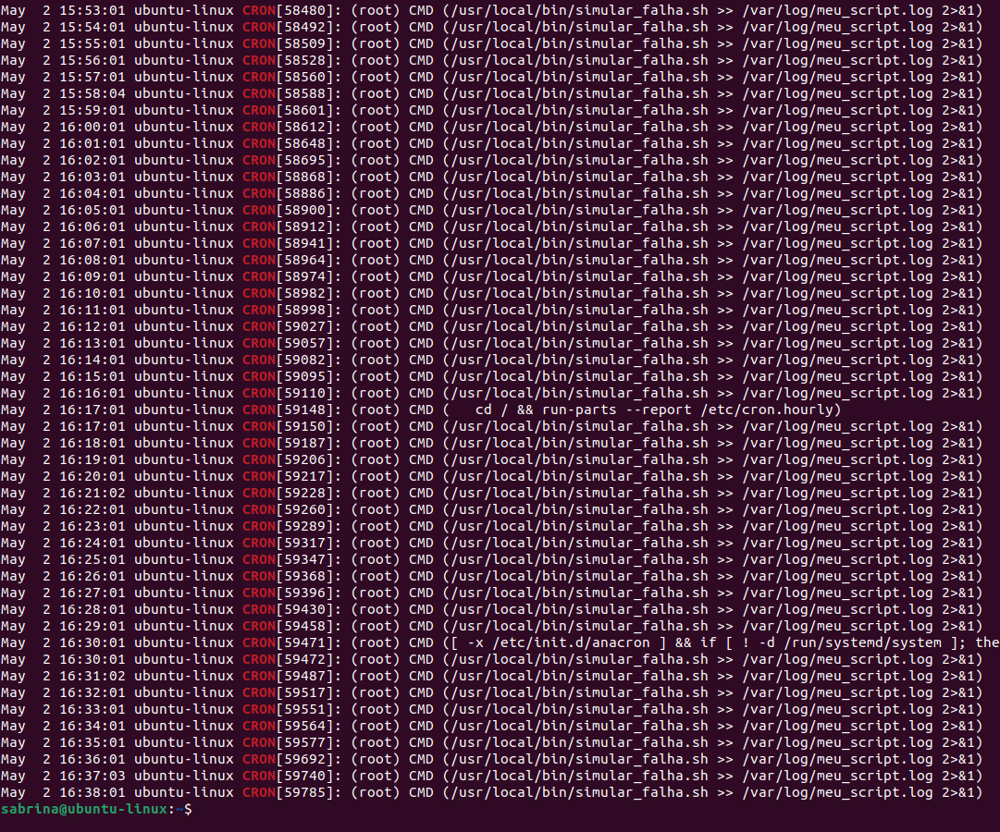
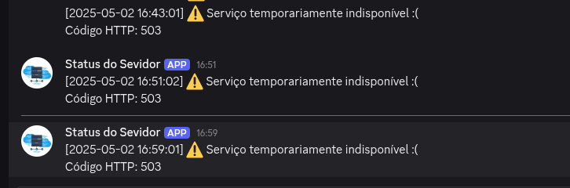

# 📄 Script de Monitoramento em bash + Nginx

Projeto em linux que consiste em subir um servidor web (Nginx), motando um arquivo em `HTML` que vai ser hospedado no Ngnix, objetivo é criar um script em bash que seja capaz de monitorar aplicação a cada 1 minuto, e se caso não esteja funcionando, o script tem que enviar uma notificação via discord avisando do problema.


## ✅ Requisitos

Instalar o Sistema Operacional Ubuntu (recomendo).

Linux com o servidor web Nginx instalado.

Permissão de root para manipular arquivos do Nginx e reiniciar o serviço.

Curl instalado para testar a conexão HTTP e enviar webhooks.


Função do script:
- **Forçar** O serviço vai ser forçado a ficar indisponível.
- **Verificar** Verifica se o serviço ta bom ou ruim, se caso estiver com problema vai ser avisado.
- **Restaurção** Quando o serviço fica indisponível, ele é restaurado automaticamente para 200.
- **Registrar** Registra nos log todo processo do serviço.
- **Notificar** via **Webhook do Discord** caso o servidor esteja indisponível (HTTP 503).
- **Automação** script configurado para rodar automaticamente a cada 1 minuto usando o `crontab`.

---

## ⚙️ Como Funciona

🛠️ Configurando Ubuntu

## Atualizar o Ubuntu

Vamos fazer a verificação de atualizações no sistema e atualizar pacotes desuatalizado.

```bash
sudo apt update
sudo apt upgrade
```

## Instalação de pacotes basico

```bash
sudo apt install curl wget git vim ufw net-tools 
```

## Instalar Ngnix e subir 

### Instalar o Ngnix

```bash
sudo apt install nginx
```
### Para inciar

```bash
sudo systemctl start nginx
```

### Habilitar o serviço

```bash
sudo systemctl enable nginx
```
### Verificar status

```bash
sudo systemctl status nginx
```

# Configuração do Site e arquivos no Nginx

## 📁 1. Clonar o Site do GitHub

Clone o repositório com o site:

```bash
cd /var/www
git clone https://github.com/SEU_USUARIO/NOME_DO_REPOSITORIO.git essencia-gourmet
```

> Substitua `SEU_USUARIO` e `NOME_DO_REPOSITORIO` conforme seu repositório real.

---

## 🌐 2. Configuração do Nginx

### A) Crie o arquivo de configuração do site:

```bash
sudo nano /etc/nginx/sites-available/essencia-gourmet
```

### B) Cole o conteúdo abaixo:

```nginx
# Configuração normal
server {
    listen 80;
    server_name localhost;

    root /var/www/essencia-gourmet;
    index index.html index.htm;

    location / {
        try_files $uri $uri/ =404;
    }
}

# Configuração de erro 503
server {
    listen 80;
    server_name localhost;

    root /var/www/essencia-gourmet;
    index index.html;

    location / {
        return 503;
    }

    error_page 503 /erro503.html;
    location = /erro503.html {
        root /var/www/essencia-gourmet;
        internal;
    }
}
```

---

## 🔗 3. Habilitar a Configuração no Nginx

Crie o link simbólico:

```bash
sudo ln -s /etc/nginx/sites-available/essencia-gourmet /etc/nginx/sites-enabled/
```

> Se o link já existir, este passo pode ser ignorado.

---

## ✔️ 4. Verificar e Reiniciar o Nginx

Verifique se a configuração está correta:

```bash
sudo nginx -t
```

Reinicie o Nginx:

```bash
sudo systemctl restart nginx
```

---

## 🧪 5. Testar o Site

Abra o navegador ou use `curl`:

```bash
curl -i http://localhost
```

---

## 📄 7. Página Personalizada de Erro (`erro503.html`)

Certifique-se de que o arquivo `erro503.html` existe em:

```
/var/www/essencia-gourmet/erro503.html
```

### Exemplo:

```html
<!DOCTYPE html>
<html lang="pt-BR">
<head>
  <meta charset="UTF-8">
  <title>Serviço Indisponível</title>
  <style>
    body {
      background: #111;
      color: #fff;
      text-align: center;
      font-family: sans-serif;
      padding: 50px;
    }
    h1 { font-size: 3em; margin-bottom: 0.5em; }
  </style>
</head>
<body>
  <h1>Servidor Indisponível no momento :(</h1>
  <h2>HTTP: 503</h2>
  <p>Por favor, tente novamente mais tarde.</p>
</body>
</html>
```
---

# Criar script de monitoramento

Criar:

Criar o arquivo de script no nano (nano é um editor de texto) e com
```bash
sudo nano /usr/local/bin/monitorar_site.sh
```
Após abrir o editor de texto, digite a linha a baixo na primeira linha, para definir o tipo de script que é em bash

**#!/bin/bash**

E depois pode começar a escrever os codigos.

Arquivos necessarios para para da o erro, restaurar, e oq arquivo ARQUIVO_DESTINO serve só para receber os arquivos copiado 

ARQUIVO_NORMAL="/etc/nginx/sites-available/essencia-gourmet-normal"
ARQUIVO_ERRO="/etc/nginx/sites-available/essencia-gourmet-erro"
ARQUIVO_DESTINO="/etc/nginx/sites-available/essencia-gourmet"
LOG_FILE="/var/log/meu_script.log"

### WEBHOOK

```bash
WEBHOOK=https://discord.com/api/webhooks/SEU_WEBHOOK_AQUI
```
1. Acesse o servidor no Discord.

2. Clique com o botão direito no canal de texto desejado e vá em Editar Canal.

3. Vá em Integrações → Webhooks → Criar Webhook.

4. Dê um nome, (opcional) avatar e selecione o canal.

5. Clique em Copiar URL do Webhook.

6. Salve as alterações.

---

## Função de envio para o Discord

```bash
enviar_webhook() {
  DATA_HORA=$(date '+%Y-%m-%d %H:%M:%S')
  MENSAGEM="$1"
  curl -H "Content-Type: application/json" -X POST \
    -d "{\"content\": \"[$DATA_HORA] $MENSAGEM\"}" "$WEBHOOK"
}
```
- Define uma função chamada enviar_webhook.

- Captura a data/hora atual.

- Envia um POST para o Webhook do Discord com o conteúdo formatado em JSON.

## Verficação do status HTTP

```bash
STATUS=$(curl -s -o /dev/null -w "%{http_code}" http://localhost)
```
- Usa curl para requisitar http://localhost silenciosamente.

- Armazena o código de status HTTP na variável STATUS.

## Geração de números aleatório

```bash
CHANCE=$(( RANDOM % 10 ))
```
- Gera um número aleatório entre 0 e 9.

- Isso será usado para definir 20% de chance de forçar um erro (valores 0 ou 1).

## :mag: Lógica Condicional do Monitoramento

### Se o servidor estiver disponível (HTTP 200):
```bash
if [ "$STATUS" -eq 200 ]; then
  echo "[INFO] Servidor disponível. Código HTTP: $STATUS" >> "$LOG_FILE"
  enviar_webhook "Servidor no ar"
```
- Registra no log que o servidor está disponível.

- Envia notificação ao Discord.

## E se a chance for menor que 2 (0 ou 1):

```bash
  if [ "$CHANCE" -lt 2 ]; then
    cp "$ARQUIVO_ERRO" "$ARQUIVO_DESTINO"
    sudo systemctl reload nginx
    echo "[INFO] Forçando erro 503..." >> "$LOG_FILE"
  fi

```
- Copia a configuração com erro para o arquivo ativo.

- Recarrega o NGINX com systemctl reload.

- Registra que a simulação de falha foi realizada.

## Se o servidor estiver fora do ar (HTTP 503):
```bash
elif [ "$STATUS" -eq 503 ]; then
  echo "[ERROR] Servidor indisponível! Código HTTP: $STATUS" >> "$LOG_FILE"
  enviar_webhook "⚠️ **Servidor Indisponível! :(**\nCódigo HTTP: $STATUS"
```
- Registra o erro no log e envia uma notificação ao Discord.

```bash
  cp "$ARQUIVO_NORMAL" "$ARQUIVO_DESTINO"
  sudo systemctl reload nginx
  echo "[INFO] Restaurando o servidor..." >> "$LOG_FILE"

```
- Restaura a configuração original do NGINX.

- Recarrega o servidor.

- Registra que a restauração foi concluída.

---

## :keyboard: Como Executar

### Torne o script executável que rode a cada 1 minuto:

```bash
chmod +x monitoramento.sh
```
### No terminal, execute: 

```bash
crontab -e
```

### Adicione esta linha ao final do arquivo:
```bash
* * * * * /caminho/para/monitoramento.sh
```
- Salve e feche o editor.
- Agora o script vai ser executado automaticamente a cada 1 minuto

--- 
# Testes de Funcionlidades

Site com serviço disponível HTPP: 200.
<br>


<br>
<br>


 Serviço indisponível com HTPP: 503.
 <br>
 
 




<br>
<br>


Registros de logs de cada status do servidor, normal, forçando erro, fcia indisponível, restaura e volta ao serviço normal.
<br>



<br>
<br>


Registro mostra que o crontab está fazendo o script rodar a cada 1 minuto.
<br>



<br>
<br>


 O script notificando a mensagem diretamente no webhook do discord.
 <br>
 
 



<br>
<br>


---
*Projeto desenvolvido como parte de estágio DevSecOps*

Desenvolvido por *Sabrina* 💙
